<div align="center">

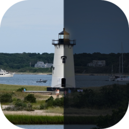

# Harbor

**A calm i3 rice that follows the light.**<br>
Apple-clean, Vercel-quiet — and at 20:00 the lighthouse switches on and the whole desktop goes with it.

[](https://github.com/dumenac/harbor/actions/workflows/check.yml)


[](LICENSE)
[](wallpapers/edgartown/LICENSE.md)

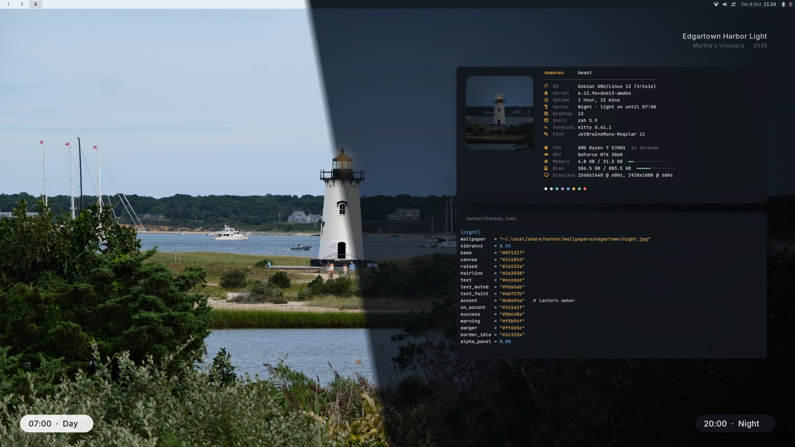

[**Install**](#install) · [Tour](#a-tour) · [Design system](docs/design.md) · [Shortcuts](docs/keybindings.md) · [Make it yours](docs/customizing.md)

</div>

<br>

Harbor treats the desktop as **one product with one design system**. A single file of tokens —
colour, type, shape, motion, sound — renders into i3, the bar, the launcher, notifications, the
terminal, GTK apps, Firefox, the lock screen and even `fastfetch`. Change a token and everything
changes together. Twice a day it changes on its own.

## Day becomes night

<div align="center">
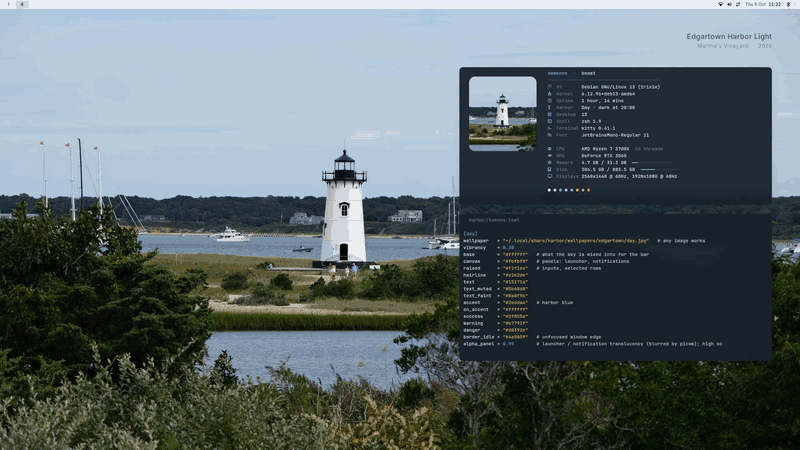
<sub>A real recording of the 20:00 switch: a 1.4 s crossfade; halfway through, the chrome follows.</sub>
</div>

<br>

At **20:00** the wallpaper crossfades to dusk and the lantern comes on. Halfway through the fade
the bar, borders, launcher, notifications, terminal, GTK apps and Firefox turn — **harbor blue on
paper white** becomes **lantern amber on slate**. At **07:00** it all comes back. A soft chime,
a one-line card ("Good evening — the harbor light is on"), and you keep working.

Auto, Light or Dark from the Control Center; `$mod+Shift+w` flips it, and flipping back to what
the clock says returns to Auto — two presses never silently cancel the schedule.

## A tour

<table>
<tr>
<td width="50%" valign="top">
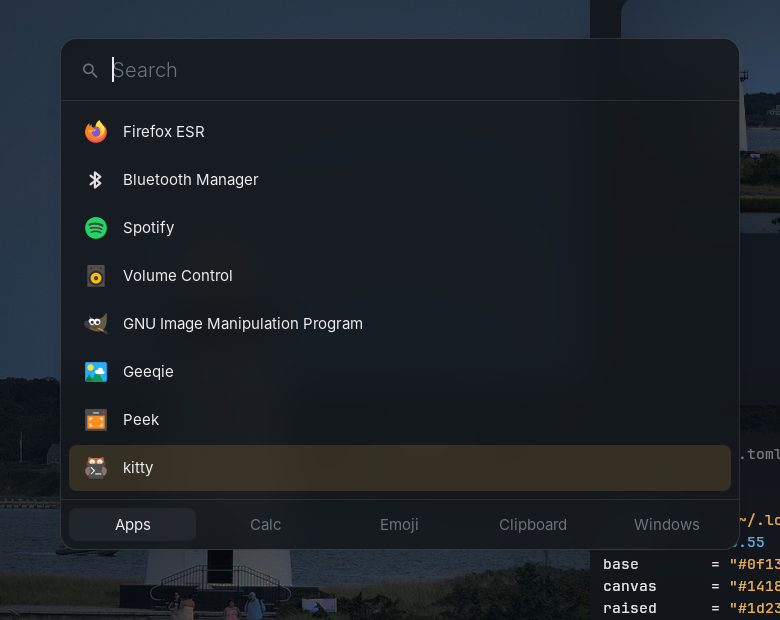
<br><b>Spotlight-style launcher</b> — <kbd>Super</kbd> <kbd>D</kbd><br>
<sub>Apps · Calc · Emoji · Clipboard · Windows, one panel. Frosted by picom, rises in with a 180 ms ease-out.</sub>
</td>
<td width="50%" valign="top">
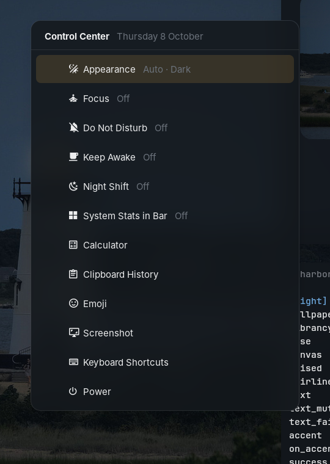
<br><b>Control Center</b> — <kbd>Super</kbd> <kbd>C</kbd> or click the sliders in the bar<br>
<sub>Appearance, Focus, Do Not Disturb, Keep Awake, Night Shift, stats, tools, power. Toggles keep it open.</sub>
</td>
</tr>
<tr>
<td valign="top">
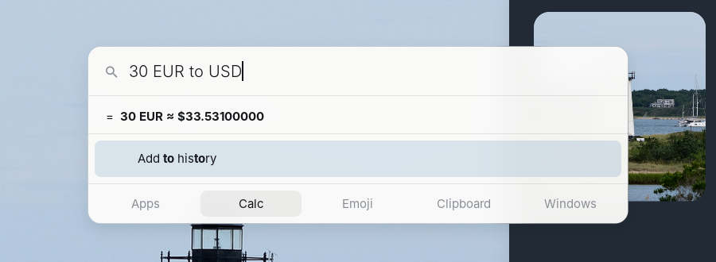
<br><b>Calculations as you type</b> — <kbd>Super</kbd> <kbd>=</kbd><br>
<sub>Units, currencies, maths (rofi-calc + qalc). <kbd>Enter</kbd> copies the result.</sub>
</td>
<td valign="top">
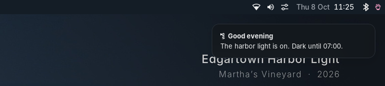
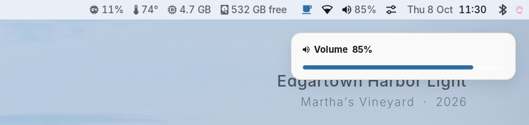
<br><b>Notifications on the window grid</b><br>
<sub>Cards line up with your tiled windows, slide in from the edge, and pause in Focus.</sub>
</td>
</tr>
<tr>
<td valign="top">
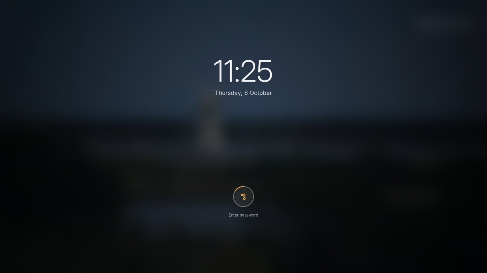
<br><b>Lock screen</b> — <kbd>Super</kbd> <kbd>X</kbd><br>
<sub>Blurred harbor, live clock, the lighthouse as your avatar. The ring takes the accent as you type, red if it's wrong.</sub>
</td>
<td valign="top">
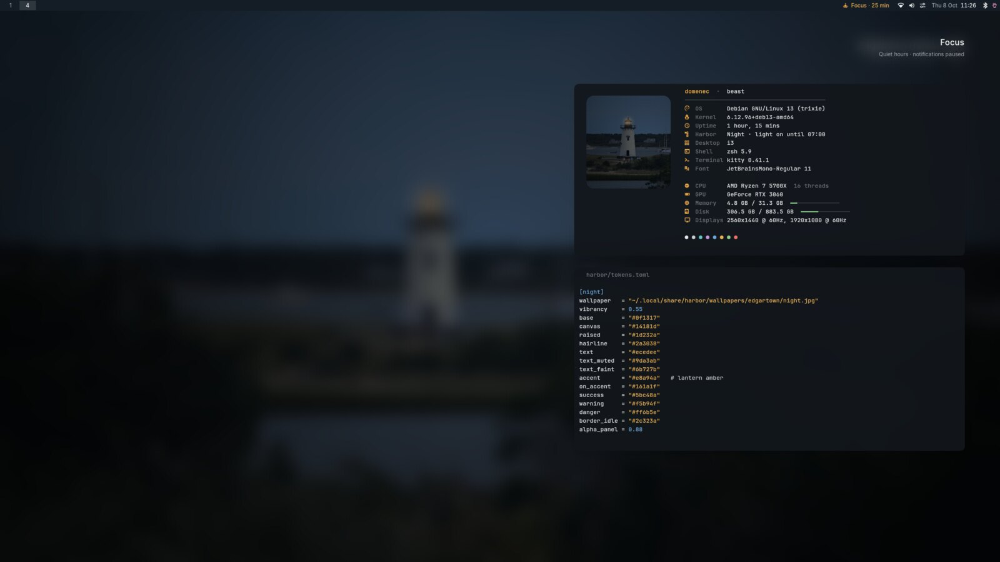
<br><b>Focus</b> — <kbd>Super</kbd> <kbd>Ctrl</kbd> <kbd>F</kbd><br>
<sub>Do Not Disturb, a softened wallpaper, a countdown in the bar, a chime when it's over. 25 / 50 / 90 min or open-ended.</sub>
</td>
</tr>
<tr>
<td valign="top">
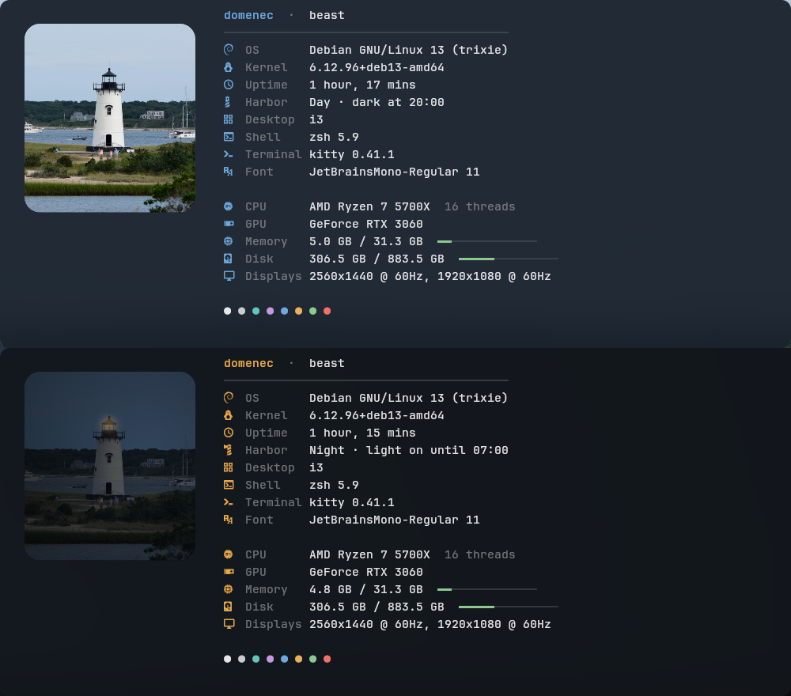
<br><b><code>fastfetch</code>, as an About card</b><br>
<sub>The lighthouse is cut from your current wallpaper. Icons in the accent, labels quiet, one hairline.</sub>
</td>
<td valign="top">
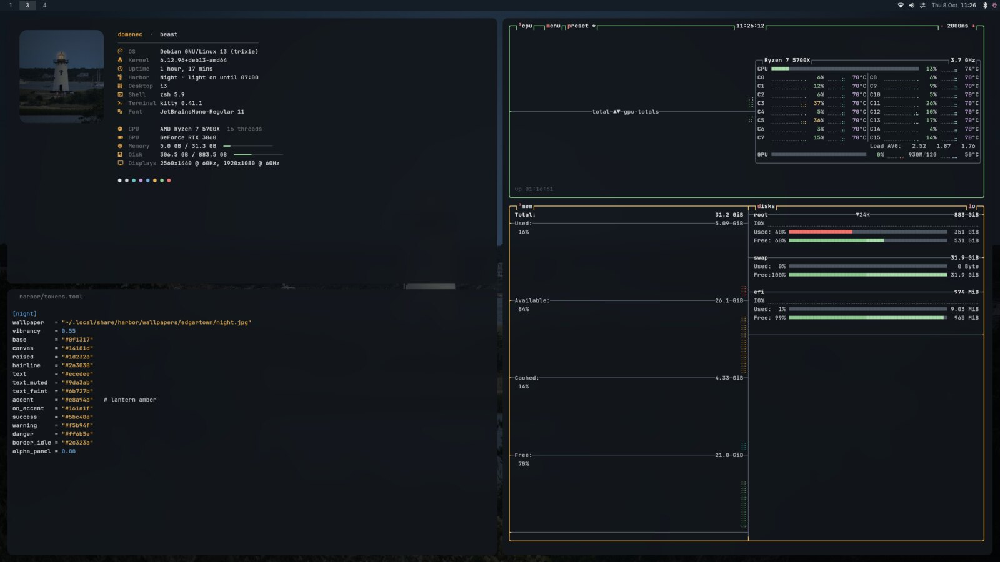
<br><b>Still i3</b><br>
<sub>Tiling, gaps, one accent border on the focused window. Rounded, shadowed and animated by picom 12.</sub>
<br><br>
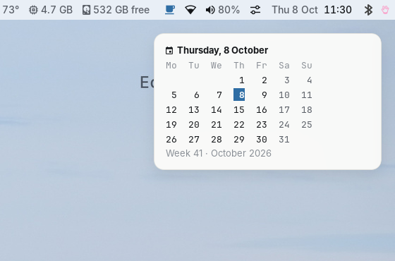
<br><sub>Click the clock for the month · right-click it for system stats.</sub>
</td>
</tr>
</table>

<div align="center">
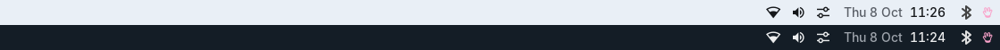
<sub>The bar, by day and by night. Its colour is your wallpaper's sky mixed into glass — so it frosts without a compositor.</sub>
</div>

## Quiet by default

- **The bar shows four things** — now playing, Wi-Fi, volume, the time. CPU, temperature, memory
  and disk appear **only when something's wrong**, then leave. Scroll the volume, click the clock.
- **One accent, and it means focus.** Focused window, active tab, selected row, typing ring.
- **Motion that explains.** Windows rise out of the desk, notifications slide in, workspaces
  cross-dissolve, the drop-down terminal (<kbd>Super</kbd> <kbd>`</kbd>) drops down. 120–260 ms, one curve.
- **Glass, not chrome.** Translucent, blurred panels; 12 px corners; soft, low shadows.
- **Small kindnesses.** A greeting when you log in. Clipboard history that never records what your
  password manager marks secret, and lives in RAM. Emoji that type themselves where you were.
  The Bluetooth tray icon re-drawn for the bar's colour. Night Shift one click away.

## Install

```sh
git clone https://github.com/dumenac/harbor && cd harbor
./install.sh            # checks dependencies, backs up what it replaces, installs
./install.sh --link     # same, but symlinks: edit the clone and see it live
```

The installer prints exactly what's missing for your distro. Everything it replaces is moved to
`~/.local/share/harbor/backups/<time>/`, and **`./uninstall.sh` puts it all back**. Your own
settings live in `~/.config/i3/local/`, which it never touches.

<details>
<summary><b>Packages</b> — Debian / Ubuntu · Arch · Fedora</summary>

**Debian 13 / Ubuntu 24.10+**
```sh
sudo apt install i3-wm rofi dunst picom kitty feh imagemagick jq xclip x11-xserver-utils x11-utils \
  libnotify-bin python3-xlib xsettingsd i3lock xss-lock maim flameshot xdotool playerctl \
  wireplumber pulseaudio-utils fastfetch gammastep dex qalc unicode-data papirus-icon-theme \
  breeze-cursor-theme fonts-inter fonts-jetbrains-mono
./extras/install-fonts.sh        # JetBrainsMono Nerd Font (icons)
./extras/build-i3lock-color.sh   # optional: clock + accent ring on the lock screen
./extras/build-rofi-calc.sh      # optional: the Calc tab (needs meson ninja-build rofi-dev libqalculate-dev)
```

**Arch**
```sh
sudo pacman -S --needed i3-wm rofi rofi-calc dunst picom kitty feh imagemagick jq xclip xorg-xrandr \
  xorg-xprop libnotify python-xlib xsettingsd i3lock-color xss-lock maim flameshot xdotool playerctl \
  wireplumber libpulse fastfetch gammastep dex libqalculate unicode-emoji papirus-icon-theme breeze \
  inter-font ttf-jetbrains-mono ttf-jetbrains-mono-nerd
```

**Fedora**
```sh
sudo dnf install i3 rofi dunst picom kitty feh ImageMagick jq xclip xrandr xprop libnotify \
  python3-xlib xsettingsd i3lock xss-lock maim flameshot xdotool playerctl wireplumber \
  pulseaudio-utils fastfetch gammastep dex-autostart qalculate unicode-emoji papirus-icon-theme \
  breeze-cursor-theme rsms-inter-fonts jetbrains-mono-fonts
./extras/install-fonts.sh && ./extras/build-i3lock-color.sh && ./extras/build-rofi-calc.sh
```

Needs **i3 ≥ 4.22**, **Python ≥ 3.11** and, for blur and motion, **picom ≥ 12**. Without a
compositor (xrdp, VNC, a VM) everything still works — just flat.
</details>

## Essentials

| | | | |
| --- | --- | --- | --- |
| <kbd>Super</kbd> <kbd>D</kbd> | Launcher | <kbd>Super</kbd> <kbd>C</kbd> | Control Center |
| <kbd>Super</kbd> <kbd>=</kbd> | Calculator | <kbd>Super</kbd> <kbd>Ctrl</kbd> <kbd>V</kbd> | Clipboard history |
| <kbd>Super</kbd> <kbd>Ctrl</kbd> <kbd>E</kbd> | Emoji | <kbd>Super</kbd> <kbd>Ctrl</kbd> <kbd>F</kbd> | Focus |
| <kbd>Super</kbd> <kbd>Shift</kbd> <kbd>W</kbd> | Light ⇄ Dark | <kbd>Super</kbd> <kbd>Ctrl</kbd> <kbd>N</kbd> | Do Not Disturb |
| <kbd>Super</kbd> <kbd>`</kbd> | Drop-down terminal | <kbd>Super</kbd> <kbd>X</kbd> | Lock |
| <kbd>Super</kbd> <kbd>Shift</kbd> <kbd>X</kbd> | Power menu | <kbd>Super</kbd> <kbd>F1</kbd> | **Every shortcut, searchable** |

The full list is [docs/keybindings.md](docs/keybindings.md) — generated from the config, so it's never stale.

## Make it yours

Put only what you want to change in `~/.config/i3/local/tokens.toml`:

```toml
[schedule]
night_starts = "21:30"

[day]
wallpaper = "~/Pictures/my-coast.jpg"     # any image; the bar picks up your sky
accent    = "#7c3aed"

[sound]
transition = ""                             # no chime
```

then `~/.config/i3/scripts/harbor apply`. Monitors, extra keys and your own startup go in the same
folder — see [docs/customizing.md](docs/customizing.md).

## How it works

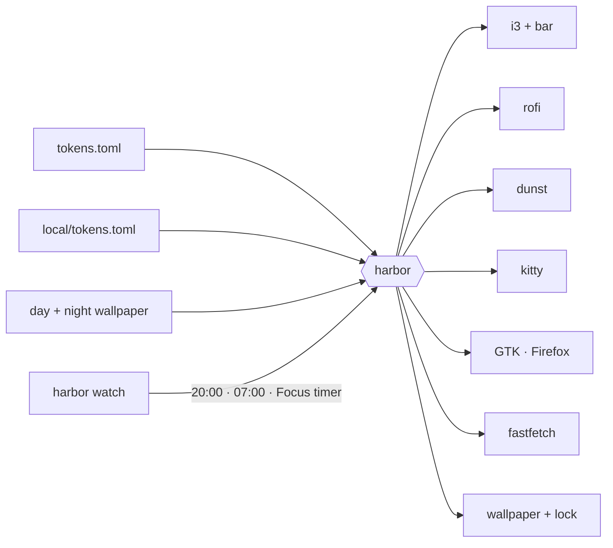

`harbor` is one dependency-free Python script: it fills templates (`look.conf`, `fastfetch.jsonc`)
and writes colour files for rofi, dunst, kitty and xsettingsd, composes the wallpaper per monitor
layout, pre-renders the 14-frame crossfade and the lock background, and reloads only what changed.
`harbor watch` sleeps until the next switch. `harbor check` renders both appearances and validates
them with `i3 -C` — it's what CI runs. Details in [docs/design.md](docs/design.md).

```
config/i3/config             i3 behaviour and keys
config/i3/harbor/            tokens.toml · look.conf · fastfetch.jsonc
config/i3/scripts/           harbor · bar.py · launcher · clipboard.py · emoji.py · keys.py · …
config/{rofi,dunst,picom,kitty}/
wallpapers/edgartown/        day.jpg · night.jpg
extras/                      build-i3lock-color.sh · build-rofi-calc.sh · install-fonts.sh
```

## Tested on

Debian 13 · i3 4.24 · picom 12.5 · rofi 1.7.5 · dunst 1.12 · kitty 0.41 · NVIDIA RTX 3060 ·
2560×1440 + 1920×1080 · and without a compositor. Something off? [docs/troubleshooting.md](docs/troubleshooting.md).

## Credits

- **Photographs** — Edgartown Harbor Light, Martha's Vineyard, by Domenec Mele,
  [CC BY-SA 4.0](wallpapers/edgartown/LICENSE.md).
- **Type** — [Inter](https://rsms.me/inter/) by Rasmus Andersson,
  [JetBrains Mono](https://www.jetbrains.com/lp/mono/), [Nerd Fonts](https://www.nerdfonts.com/)
  (Material Design Icons).
- **Built on** i3, picom, rofi, [rofi-calc](https://github.com/svenstaro/rofi-calc), dunst, kitty,
  [i3lock-color](https://github.com/Raymo111/i3lock-color), fastfetch, xsettingsd.
- **Inspired by** the quiet of macOS and Vercel's design language.

## License

Code: [MIT](LICENSE). Photographs: [CC BY-SA 4.0](wallpapers/edgartown/LICENSE.md).
