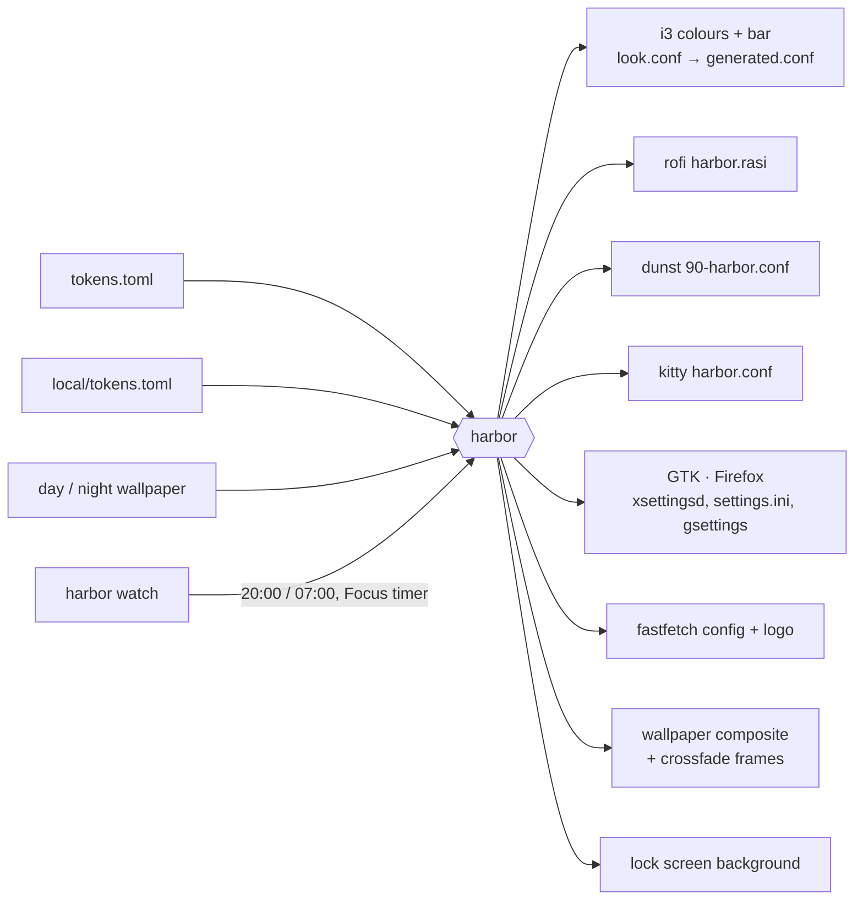

# Harbor — the design system

Harbor is an i3 desktop that behaves like one product. Every surface — window borders, the
bar, the launcher, notifications, the terminal, GTK apps, the lock screen, even `fastfetch` —
is rendered from one file of design tokens, so it changes together. Twice a day it changes
on its own: at 20:00 the lighthouse on the wallpaper switches on and the whole desktop follows.

## Principles

1. **Quiet by default.** The bar shows four things: now playing, Wi-Fi, volume, the time. CPU,
   temperature, memory and disk appear only when something needs attention, then go away.
2. **One accent, and it means focus.** The focused window, the active tab, the selected row,
   the typing ring on the lock screen: all accent. Nothing else is coloured.
3. **Day and night are one design, not two themes.** Same layout, same type, same spacing;
   only the light changes — harbor blue on paper white by day, lantern amber on slate at night.
4. **Glass, not chrome.** Panels are translucent and blurred over the wallpaper; the bar mixes
   the wallpaper's sky into its colour so it reads as frosted glass even without a compositor.
5. **Motion explains, never performs.** One ease-out curve, 120–260 ms. New windows rise out of
   the desk, notifications slide in from the edge, workspaces cross-dissolve, the drop-down
   terminal drops down. The only slow thing is dusk: a 1.4 s crossfade at 20:00.
6. **Everything has a keyboard path and a mouse path.** Click the clock for a calendar, the
   sliders icon for the Control Center, scroll the volume; or `$mod+c`, `$mod+d`, `$mod+F1`.

## Tokens

All in [`config/i3/harbor/tokens.toml`](../config/i3/harbor/tokens.toml). Override any of them in
`~/.config/i3/local/tokens.toml`; `harbor apply` re-renders everything.

### Colour

| Token | Day | Night | Used for |
| --- | --- | --- | --- |
| `canvas` |  `#fbfbf9` |  `#14181d` | launcher, notifications, Control Center |
| `raised` |  `#f1f1ee` |  `#1d232a` | inactive tabs, fields |
| `hairline` |  `#e2e2de` |  `#2a3038` | 1 px dividers and frames |
| `text` |  `#15171a` |  `#ecedee` | primary text |
| `text_muted` |  `#5b6068` |  `#9da3ab` | secondary text, dates |
| `text_faint` |  `#8a8f96` |  `#6b727b` | hints, placeholders |
| `accent` |  `#2e6da4` harbor blue |  `#e8a94a` lantern amber | focus, selection, progress |
| `danger` |  `#d0392e` |  `#ff6b5e` | urgent, wrong password |

Derived at render time:

- **`bar`** = `base` mixed with the average colour of the wallpaper's top strip (`vibrancy`:
  0.30 by day, 0.55 at night) — the bar looks like frosted glass over *your* sky.
- **pills** (focused / visible workspace) = `bar` mixed 12 % / 6 % toward `text`.
- **terminal** colours are their own set (`[terminal]`): kitty stays dark in both appearances so
  TUIs keep working; the background shifts from dusk blue to harbor night and the cursor takes
  the accent.

### Type

| Token | Value | Where |
| --- | --- | --- |
| `ui` | Inter | everything with words |
| `display` | Inter Display (Light) | the lock-screen clock |
| `mono` | JetBrains Mono | terminal, calendar, shortcut sheet |
| `icons` | JetBrainsMono Nerd Font | Material Design glyphs, used like SF Symbols — one weight, a step larger than the text beside them |

Sizes are **pixels**, like CSS (`size_bar = 14`, `size_menu = 15`, …). i3 and i3bar scale
fonts by the X screen's DPI while rofi and dunst use 96, so point sizes would come out
different everywhere; Pango's `14px` comes out the same.

### Shape

`radius_window 12` · `radius_panel 16` · `radius_notify 14` · `radius_small 8` ·
`border 2` · `gap_inner 10` · `gap_outer 3`. Notification cards sit **on the window grid** —
their right and top edges line up with the tiled windows (`notify_offset = "auto"` measures it).

### Motion

One curve — `cubic-bezier(0.2, 0.8, 0.2, 1)` — at three speeds: 120 ms (dismiss, hide),
180 ms (open, show), 260 ms (slide). The Day ⇄ Night crossfade is 1.4 s, with the chrome
switching at its midpoint.

## How it renders

`harbor watch` is a tiny per-session daemon: it sleeps until the next switch or Focus deadline,
then runs `harbor apply --fade`. Everything is cached — composites per monitor layout, the
14-frame crossfade, the lock background, the fastfetch logo — so the switch costs nothing.
